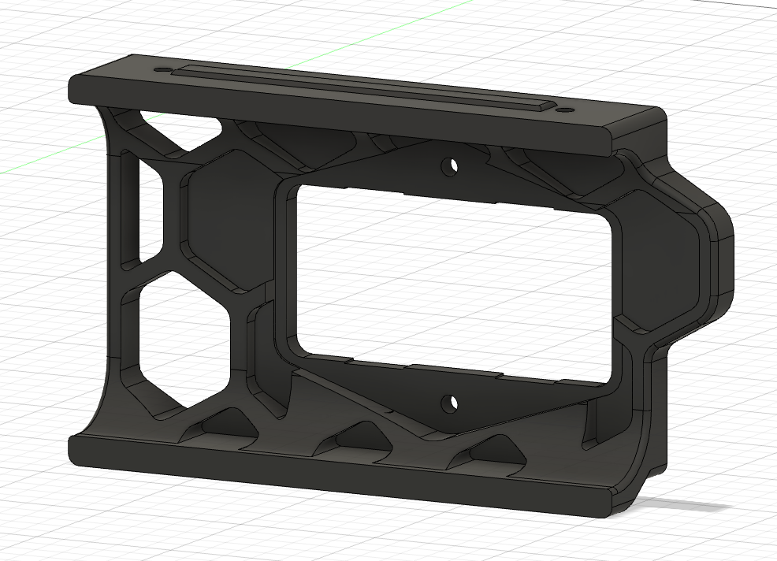
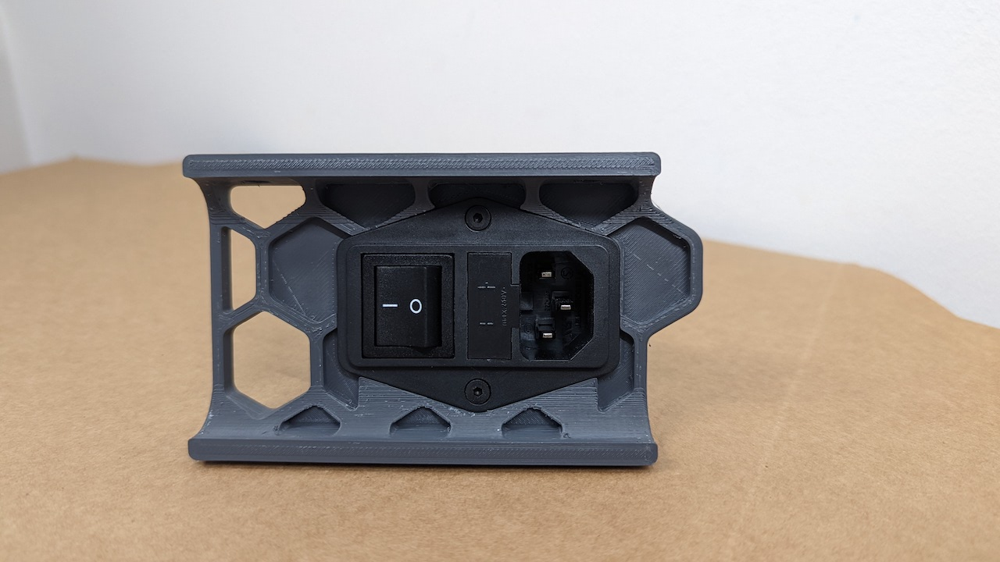
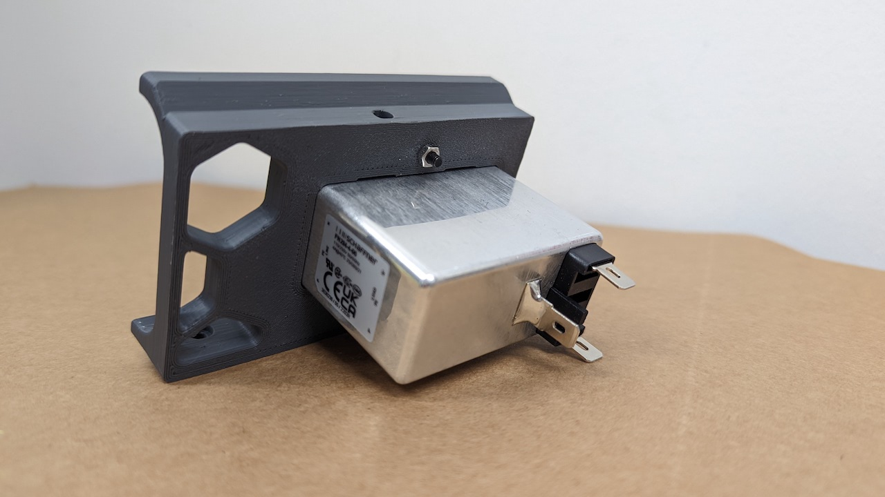

# Trident skirt for Schaffner FN284-4-06  
  
Voron Trident skirt mod for the Schaffner FN284-4-06 combined power inlet.  
Using two M3 FHCS with nuts to mount it to the skirt.
  
#### BOM:
- 2x M3x12mm FHCS
- 2x M3 nut  
  
  
  
  
  
  