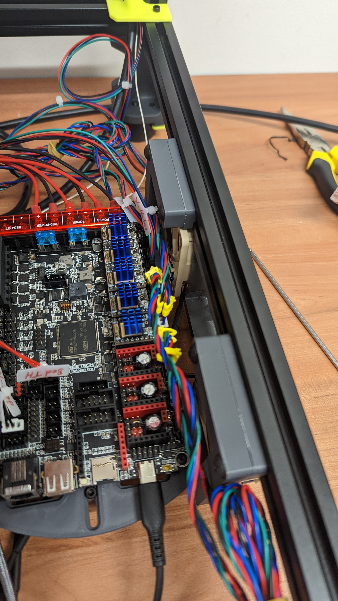

# Voron Trident Spacer for Inverted Electronics with Noctua A6x25
  
Building a Voron Trident using the “InvertedElectronics” Mod, I realized that the it does not fit with my Noctua A6x25.
To make it work, I've created a spacer (5.5mm) based on the DIN rail frame mount.
  
#### BOM:
- 2x M5x20mm BHCS
    
